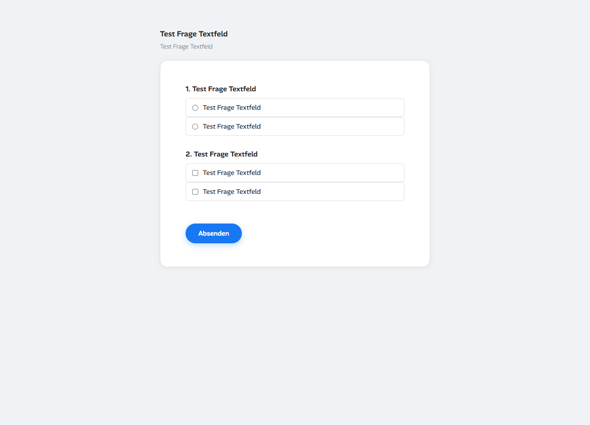
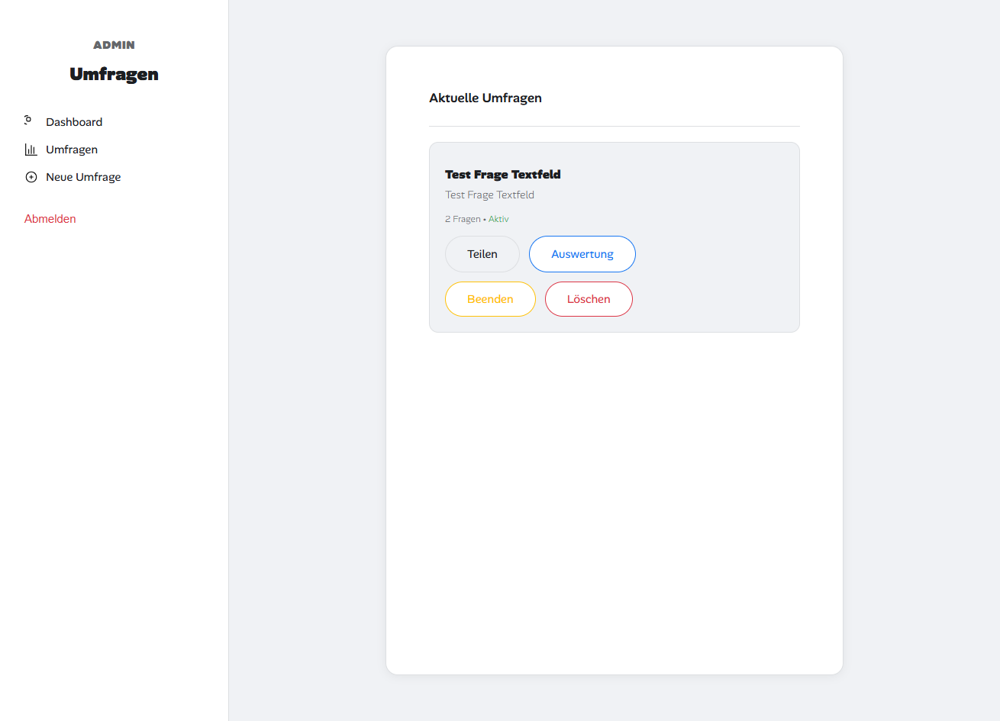
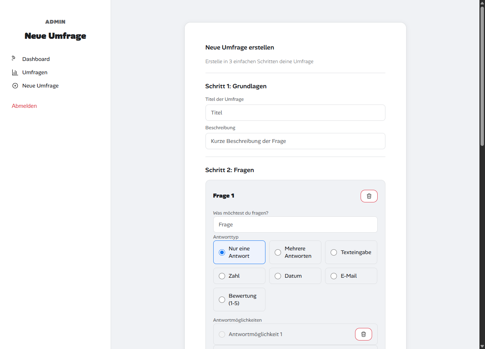

# Umfrage Tool



## Projektbeschreibung

Ein webbasiertes Umfrage-Tool zur Erstellung und Durchführung von Umfragen. Benutzer können Umfragen erstellen, verwalten und öffentlich zur Verfügung stellen. Das Tool bietet eine moderne Benutzeroberfläche mit Unterstützung für verschiedene Fragetypen und eine vollständige Auswertungsfunktion.





---

## Funktionen

### Teilnehmer-Bereich (Öffentlich)

#### Umfrageteilnahme
- **Öffentliche Umfrageteilnahme**: Benutzer können Umfragen über einen geteilten Link aufrufen und ausfüllen
- **Mehrfachteilnahme-Handling**: Teilnehmer können ihre Antworten nur einmalig abgeben. Bei erneutem Aufruf der Umfrage werden die bereits gegebenen Antworten angezeigt (im Read-Only-Modus)
- **Cookie-basierte Teilnehmererkennung**: Jeder Teilnehmer erhält eine eindeutige ID über Cookies, um Mehrfachabgaben zu verhindern
- **Beantwortung aktualisieren**: Teilnehmer können ihre Antworten vor dem Absenden beliebig oft ändern

#### Umfragestatus
- **Aktive Umfragen**: Neue Umfragen sind automatisch aktiv und können ausgefüllt werden
- **Beendete Umfragen**: Admins können Umfragen beenden. Danach können keine Antworten mehr abgegeben werden
- **Statusanzeige**: Auf der Startseite wird der Status jeder Umfrage angezeigt (aktiv/beendet)

#### Bestätigungsseite
- **Danke-Seite**: Nach dem erfolgreichen Absenden wird eine Bestätigungsseite angezeigt
- **Weiterleitung**: Automatische Weiterleitung zur Startseite möglich

---

### Admin-Bereich

#### Umfrageverwaltung
- **Umfrage erstellen**: Vollständiger Editor für neue Umfragen mit Titel und Beschreibung
- **Umfrage bearbeiten**: Vorhandene Umfragen können bearbeitet werden
- **Umfrage löschen**: Umfragen können mit allen zugehörigen Daten gelöscht werden
- **Umfrage beenden/aktivieren**: Umfragen können manuell beendet oder wieder aktiviert werden

#### Fragetypen

| Fragetyp | Beschreibung | Beispiel |
|----------|--------------|----------|
| `radio` | Einfachauswahl (eine Antwort) | Ja / Nein |
| `checkbox` | Mehrfachauswahl (mehrere Antworten) | Welche Sprachen sprechen Sie? |
| `text` | Freitextfeld | Bitte beschreiben Sie... |
| `number` | Zahlenfeld | Ihr Alter |
| `date` | Datumsauswahl | Geburtsdatum |
| `email` | E-Mail-Feld | Ihre E-Mail-Adresse |
| `range` | Slider (1-5) | Zufriedenheitsbewertung |

#### Frage-Editor
- **Fragen hinzufügen**: Beliebig viele Fragen pro Umfrage
- **Antwortoptionen**: Bei radio/checkbox können eigene Antwortmöglichkeiten definiert werden
- **Fragen reihenfolge**: Fragen können per Drag & Drop sortiert werden
- **Fragen löschen**: Einzelne Fragen können entfernt werden
- **Validierung**: Pflichtfelder werden automatisch validiert

#### Auswertung
- **Gesamtteilnehmer**: Anzahl der eindeutigen Teilnehmer (basierend auf Cookie-ID)
- **Fragenauswertung**: Für jede Frage werden die Antworten aggregiert
- **Radio/Checkbox**: Anzahl und Prozente jeder Antwortoption
- **Textfelder**: Sammlung aller Freitext-Antworten
- **Range**: Durchschnittsbewertung
- **Export**: Daten können für weitere Auswertungen genutzt werden

#### Admin-Anmeldung
- **Sichere Anmeldung**: Passwort wird serverseitig geprüft
- **Session-Management**: Anmeldung bleibt 7 Tage erhalten (Cookie-basiert)
- **SHA256 Token**: Sichere Token-basierte Authentifizierung
- **Logout**: Möglichkeit sich abzumelden

---

### Technische Funktionen

#### Datenbank
- **MySQL**: Alle Daten werden in einer MySQL-Datenbank gespeichert
- **JSON-Speicherung**: Antworten werden als JSON gespeichert für flexible Struktur
- **IP-Logging**: IP-Adressen der Teilnehmer werden erfasst
- **Zeitstempel**: Alle Aktionen werden mit Zeitstempel versehen
- **Indizes**: Datenbank-indizes für schnelle Abfragen

#### Sicherheit
- **SQL-Injection Schutz**: Prepared Statements werden verwendet
- **XSS-Schutz**: HTML-Escaping bei der Ausgabe
- **Admin-Token**: Sichere Cookie-basierte Authentifizierung
- **CORS**: Beschränkter Zugriff auf API-Endpunkte

#### API-Endpunkte

| Endpunkt | Methode | Funktion |
|----------|---------|----------|
| `/api/umfrage.php` | GET | Alle Umfragen oder einzelne Umfrage laden |
| `/api/umfrage.php` | POST | Neue Umfrage erstellen (Admin) |
| `/api/umfrage.php` | PUT | Umfrage status ändern (Admin) |
| `/api/umfrage.php` | DELETE | Umfrage löschen (Admin) |
| `/api/antworten.php` | GET | Antworten laden (eigene oder Auswertung) |
| `/api/antworten.php` | POST | Antworten speichern |
| `/api/antworten.php` | POST | Antworten löschen |
| `/api/login.php` | POST | Admin-Anmeldung |
| `/api/login.php` | DELETE | Admin-Logout |

---

## Technologie

- **Backend**: PHP 7.4+
- **Datenbank**: MySQL
- **Frontend**: HTML5, CSS3, Vanilla JavaScript
- **Keine Frameworks**: Reine PHP/JS-Lösung ohne externe Abhängigkeiten

---

## Datenbank-Struktur

### Tabellen

```sql
umfragen          -- Hauptumfragen
fragen            -- Fragen innerhalb einer Umfrage
antwort_optionen  -- Antwortmöglichkeiten für radio/checkbox
teilnehmer_antworten  -- Gespeicherte Teilnehmerantworten
```

---

## Ordnerstruktur

```
/
├── index.php              # Startseite mit Umfrageliste
├── config.php             # Datenbank-Konfiguration
├── script.js              # Frontend JavaScript Logik
├── style.css              # CSS Styling
├── public/
│   ├── survey.html        # Öffentliche Umfrageseite
│   └── danke.html         # Bestätigungsseite
├── admin/
│   ├── index.php          # Admin Dashboard
│   ├── create.html        # Umfrage erstellen/bearbeiten
│   └── auth.js            # Admin Authentifizierung
├── api/
│   ├── umfrage.php        # Umfrage API
│   ├── antworten.php      # Antworten API
│   └── login.php          # Login API
└── database/
    └── schema.sql         # Datenbankschema
```

---

## Lizenz

MIT
